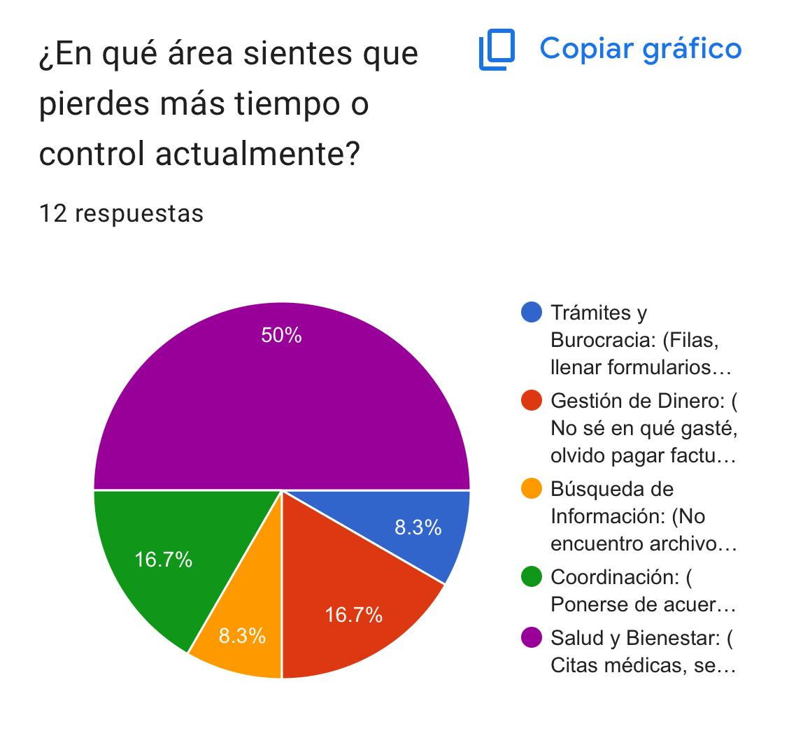
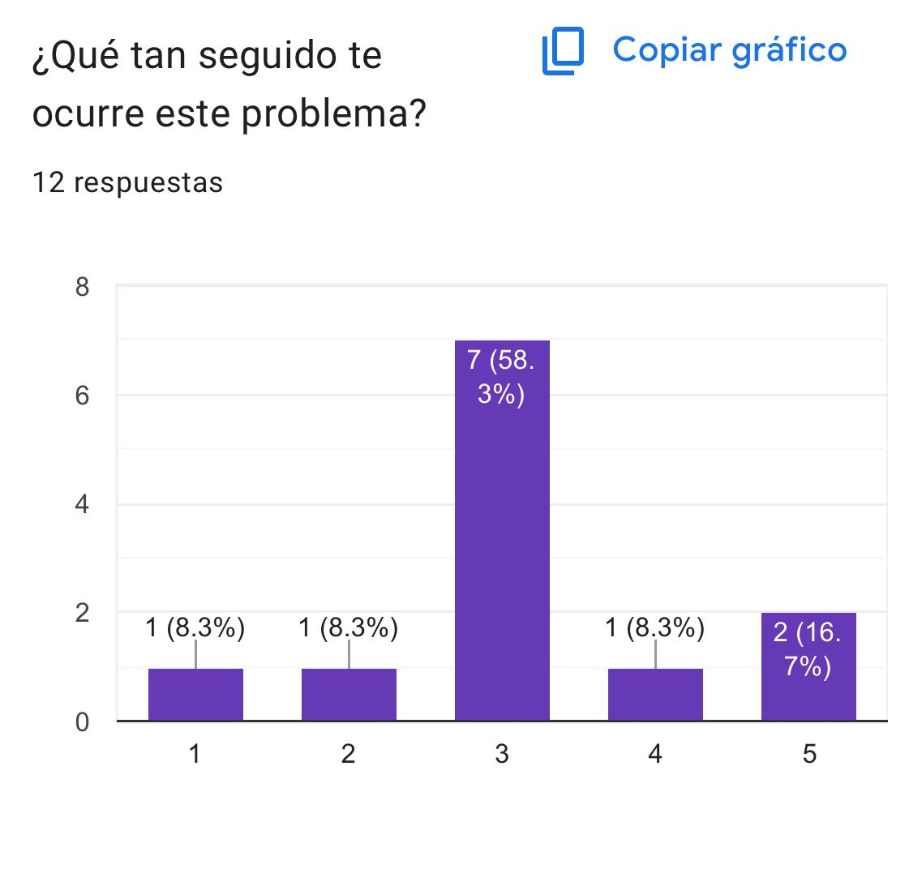

evidencia de campo

• El Problema

En la encuesta realizada, el principal dolor detectado fue la dificultad para acceder oportunamente a servicios de salud. Los usuarios manifestaron largas esperas en urgencias (hasta 6 horas) y problemas para agendar citas médicas por falta de disponibilidad.

Este problema genera pérdida de tiempo, frustración y retraso en la atención médica necesaria.

• Resultados de la Sonda

 Enlace al formulario (Forms):https://docs.google.com/forms/d/e/1FAIpQLSf2m4vTc59WdL9POwSHPVG2PLR0IU40XJWI79Iu2iPd6JFuFg/viewform?usp=publish-editor

Resumen de los datos obtenidos:

El 50 % de los encuestados indicó que su mayor problema está relacionado con Salud y Bienestar (citas médicas y urgencias).

link de la hoja de calculo de las repsuestas del forum :https://docs.google.com/spreadsheets/d/1m4lu5KAhYPiXWN9RxNdKXbcAixeNopRTc8iNBJd3W94/edit?usp=drivesdk

Varias respuestas abiertas mencionan:

•Esperas de hasta 6 horas en urgencias.

•Falta de disponibilidad de citas.

•Dificultad para solicitar citas médicas.

La frecuencia promedio del problema fue 3/5, lo que indica que es un problema recurrente.

Conclusión: La mayoría de los encuestados experimenta demoras o dificultades en el acceso a servicios médicos.

• ¿Qué duele?

“Fui a urgencias y esperé 6 horas para que me revisaran.”

• Frecuencia:

Es un problema recurrente (3/5).

• La Solución Soñada:

“Disponibilidad de citas médicas.”

Definición Funcional

Historia de Usuario Principal (User Story)

Como paciente que necesita atención médica, quiero ver y agendar citas médicas disponibles desde una app, para evitar largas esperas y saber cuándo seré atendido.

Criterios de Aceptación (Definition of Done)

▪ El sistema debe mostrar disponibilidad real de citas médicas actualizadas.
▪ El usuario debe poder agendar, cancelar o reprogramar una cita.
▪ El usuario debe recibir confirmación inmediata por correo o notificación push.
▪ El tiempo de carga debe ser menor a 2 segundos.
▪ El sistema debe funcionar correctamente en dispositivos móviles (Responsive).
▪ El usuario debe poder ver el tiempo estimado de espera en urgencias.

Requisitos Funcionales (Draft Técnico)

RF-01 (Autenticación):
El sistema debe permitir registro e inicio de sesión seguro mediante correo y contraseña.

RF-02 (Gestión de Citas):
El sistema debe consultar en la base de datos la disponibilidad de médicos por especialidad y fecha.

RF-03 (Agendamiento):
El sistema debe registrar la cita seleccionada asociándola al ID del usuario y al ID del profesional de salud.

RF-04 (Notificaciones):
El sistema debe enviar confirmación automática por correo electrónico y notificación push al agendar o modificar una cita.

RF-05 (Gestión de Turnos):
El sistema debe calcular y mostrar el tiempo estimado de espera en urgencias basado en la cantidad de pacientes en fila.

RF-06 (Base de Datos):
El sistema debe almacenar la información de usuarios, médicos, especialidades, horarios y citas en una base de datos relacional.

## Arquitectura propuesta 
